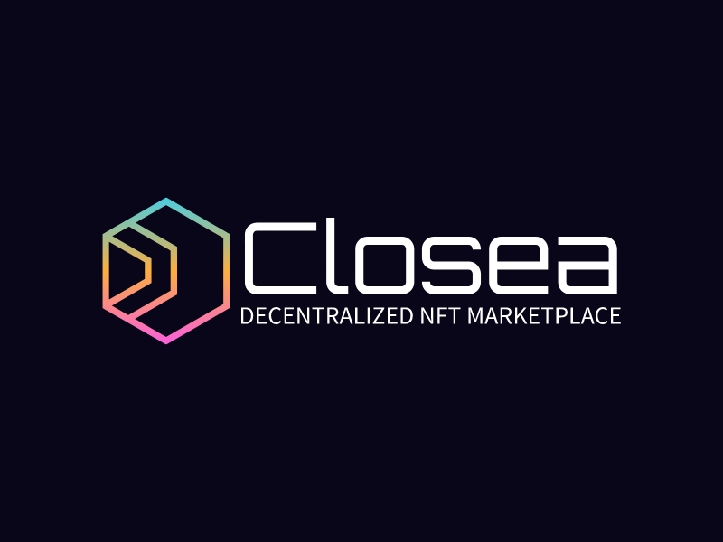

# Closea




Decentralized OpenSea-like NFT marketplace

## Introduction
Closea - pronounced as "close sea", is a decentralized OpenSea-like NFT marketplace which allows user to buy or sell NFTs at

## Git Hooks
Install git hook by
```shell
$ make
```

## Build
```shell
$ npm i
$ npm run build --output-path=./dist
```

## Author
[ambersun1234](https://github.com/ambersun1234)

## License
This project is licensed under GNU General Public License v3 - see the [License](./LICENSE) file for more detail